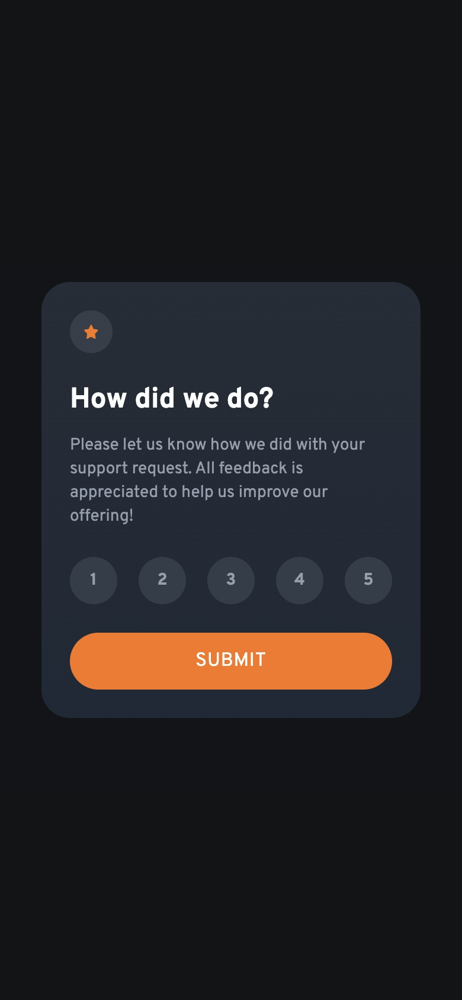
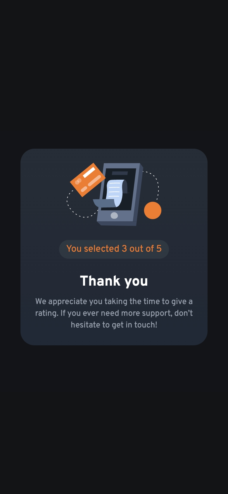

- Превью: https://kseylo.github.io/interactive-rating/
## Установка:

Установка зависимостей
```
pnpm install
```

Запуск
```
pnpm dev
```

## Скриншот:
### Форма:


### Thank You State:

## Технологии которые использовал:
- HTML
- Tailwindcss
- Typescript

## Проблемы с которыми столкнулся:
- Как отобразить thank-you-state после того как пользователь выбрал рейтинг и нажал на кнопку подтверждения
  Решение:
- Сделал две секции, одна для формы, другая для thank-you-state, вторую спрятал с помощью tailwindcss стиля hidden
-
```typescript
// Событие которое срабатывает на клик мыши по кнопки подтверждения
submitBtn?.addEventListener('click', () => {  
// Если рейтинг больше 0, т.е рейтинг выбран
if (selectedRating > 0) {
    // добавляем форме   
    ratingForm?.classList.add('hidden')  
    document.getElementById('rating-state')!.innerHTML =  
        `You selected ${selectedRating} out of 5`        
    // Убираем у thank-you hidden и добавляем flex
    thankYou?.classList.add('flex')  
    thankYou?.classList.remove('hidden')  
}  
})
```

- Управление состоянием рейтинга когда на него кликнули
Решение:
```typescript
// На каждый элемент повесил слушать события на клик
ratings.forEach((item, index) => {  
    item.addEventListener('click', () => {  
        handleRatingClick(index)  
    })  
})

function handleRatingClick(index: number) {
	// если выбранный рейтинг совпадает с тем на который кликнули
    if (selectedRating === index + 1) {
	    // Отменяем выбор рейтинга  
        selectedRating = 0  
    } else {
	    // Устанавливаем значение рейтинга соотвествующие индексу выбранного элемента + 1  
        selectedRating = index + 1  
    }  
  
    ratings.forEach((item, i) => {
	    // если текущий индекс соотвествует индексу элемента на который кликнули 
        if (i === index) {
	         // Устанавливаем/удаляем класс active-rating
            item.classList.toggle('active-rating', selectedRating !== 0)  
        } else {
	        // Удаляем класс active-rating у всех остальных элементов  
            item.classList.remove('active-rating')  
        }    })  
}
```